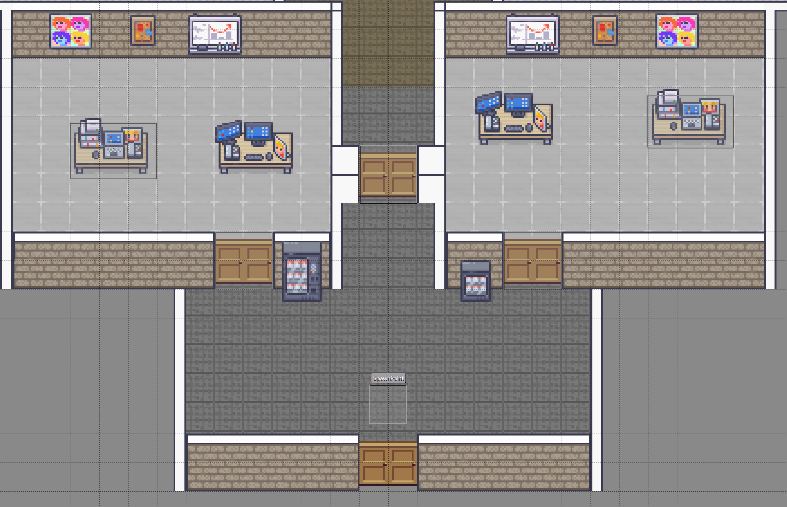
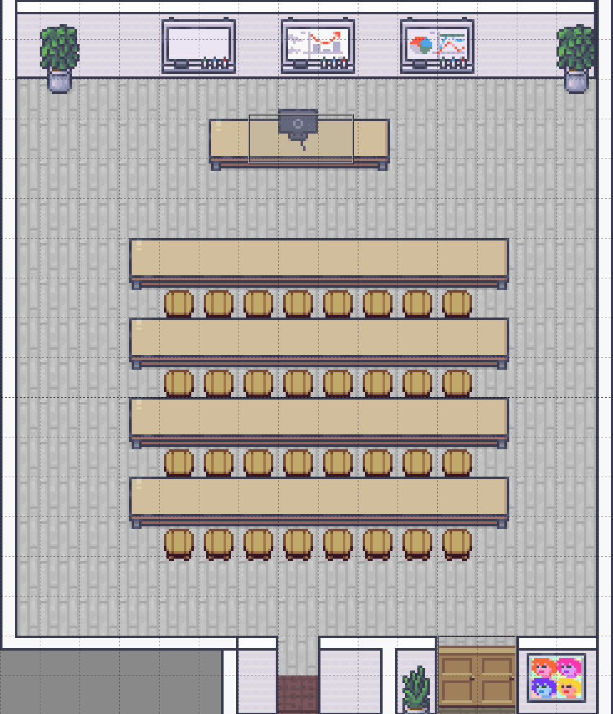
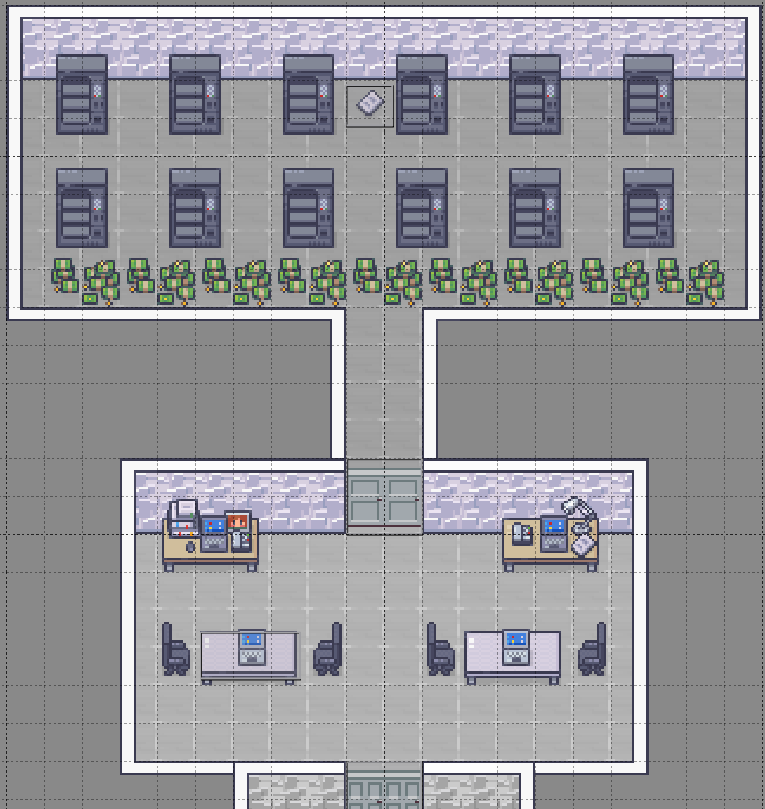
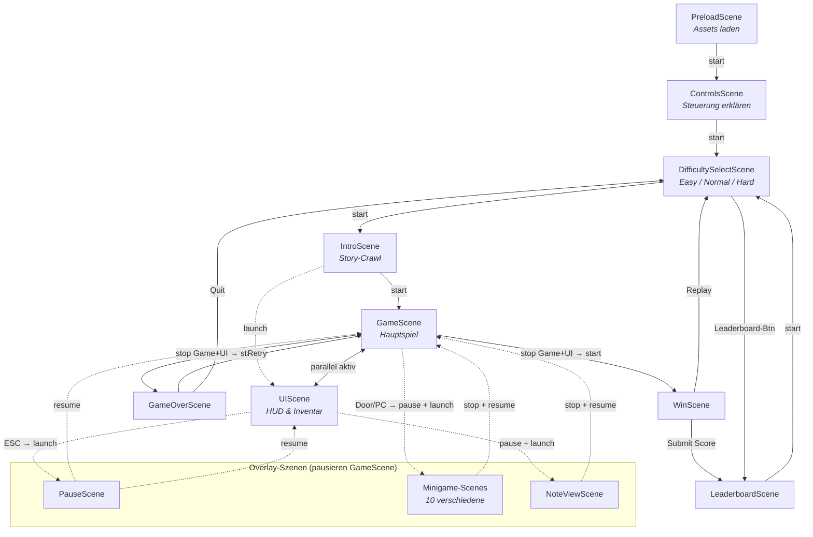

# Dokumentation: Night Protocol

**Erstellt von Jonathan Kechter**
**Technische Hochschule Nürnberg Georg Simon Ohm**
**Retrohm Projekt – Wintersemester 2025/2026**

---

## Inhaltsverzeichnis

1. [Einleitung](#1-einleitung)
2. [Spielkonzept](#2-spielkonzept)
   - 2.1 [Setting & Story](#21-setting--story)
   - 2.2 [Visuelle Identität & Assets](#22-visuelle-identität--assets)
3. [Gameplay & Mechaniken](#3-gameplay--mechaniken)
   - 3.1 [Game Loop](#31-game-loop)
   - 3.2 [Steuerung & Kamera](#32-steuerung--kamera)
   - 3.3 [Stealth-Mechanik & Bot-KI](#33-stealth-mechanik--bot-ki)
   - 3.4 [Interaktionssystem (Türen, Items, Terminals)](#34-interaktionssystem-türen-items-terminals)
   - 3.5 [Minigames](#35-minigames)
   - 3.6 [Fail State & Win Condition](#36-fail-state--win-condition)
   - 3.7 [Schwierigkeitsgrade](#37-schwierigkeitsgrade)
4. [Technische Dokumentation](#4-technische-dokumentation)
   - 4.1 [Technologie-Stack](#41-technologie-stack)
   - 4.2 [Projektarchitektur & Ordnerstruktur](#42-projektarchitektur--ordnerstruktur)
   - 4.3 [Scene Flow & Game Loop](#43-scene-flow--game-loop)
   - 4.4 [Lighting & Atmosphäre](#44-lighting--atmosphäre)
   - 4.5 [Audio-Design](#45-audio-design)
   - 4.6 [Map Building & Level Design](#46-map-building--level-design)
   - 4.7 [Testing](#47-testing)
5. [Vibe Coding Experience](#5-vibe-coding-experience)
   - 5.1 [KI-Workflow & Tool-Evolution](#51-ki-workflow--tool-evolution)
   - 5.2 [Entwicklungsphasen](#52-entwicklungsphasen)
   - 5.3 [AI Learnings – Was funktioniert hat](#53-ai-learnings--was-funktioniert-hat)
   - 5.4 [AI Problems – Herausforderungen mit KI](#54-ai-problems--herausforderungen-mit-ki)
   - 5.5 [Denkwürdige KI-Interaktionen](#55-denkwürdige-ki-interaktionen)
6. [Known Issues & Further Work](#6-known-issues--further-work)
7. [Fazit](#7-fazit)

---

## 1. Einleitung

Die Entwicklungen im Bereich der generativen KI haben in den letzten Jahren enorme Fortschritte gemacht. Durch die immer besser werdenden Modelle und die dadurch steigende Qualität an generiertem Code hat sich zunehmend ein Trend namens „Vibe Coding" entwickelt. Beim Vibe Coding wird Code ausschließlich mit Hilfe von KI-Werkzeugen erstellt. Hierdurch können Ideen mit hoher Geschwindigkeit in funktionierenden Code umgesetzt werden. Dieser Trend bietet viele Vorteile, birgt aber auch einige Herausforderungen, die in der folgenden Dokumentation genauer beleuchtet werden.

Im Rahmen des Projektes „Retrohm" bestand die Aufgabe darin, ein browserbasiertes Spiel mit dem Framework Phaser 3 zu entwickeln. Dabei sollte der Fokus darauf liegen, den Prozess des Vibe Codings in möglichst vielen Szenarien bei der Entwicklung eines Spieles zu dokumentieren und zu reflektieren. Das Ergebnis dieser Arbeit ist das Spiel **„Night Protocol"**. In dem Spiel schlüpft der Spieler in die Rolle eines Studenten, der nachts in die geschlossene Technische Hochschule einbricht, um die Lösung der anstehenden Klausur zu finden. Dabei muss er durch die Hochschule bis zum Serverraum vordringen, ohne von den Campus Security Bots entdeckt zu werden. Die Atmosphäre im Spiel ist mysteriös, düster und technisch geprägt.

---

## 2. Spielkonzept

### 2.1 Setting & Story

**„Night Protocol"** ist ein Top-Down Stealth-Adventure. Das Szenario versetzt den Spieler in die Rolle eines Studenten, der nachts in die geschlossene Technische Hochschule einbricht, um die Lösung der anstehenden Klausur zu stehlen. Das Ziel ist es, durch die Hochschule bis zum Serverraum vorzudringen und dabei den patrouillierenden Campus Security Bots auszuweichen. Die Atmosphäre im Spiel ist mysteriös, düster und technisch geprägt.

Das Setting ist bewusst gewählt, um eine hohe Spannung durch die düstere Atmosphäre, die bedrohlichen Sicherheitsroboter und die hinterlegten Sounds zu erzeugen. <!-- TODO überarbeiten -->

### 2.2 Visuelle Identität & Assets

Die visuelle Gestaltung soll die beklemmende Atmosphäre einer leeren Hochschule bei Nacht einfangen.

**Herausforderung & Lösung:**
Die Suche nach kostenlosen Assets („Free Assets") erwies sich als problematisch (Stilbrüche, Fantasy-Setting). Auch generative KI scheiterte an der Konsistenz der Pixel-Art-Perspektive.

Eine längere Recherche ergab folgende Tilesets als mögliche Kandidaten:

| Tileset                     | Quelle                                                                                   |
| --------------------------- | ---------------------------------------------------------------------------------------- |
| **Dungeon Pack**            | [craftpix.net](https://craftpix.net/freebies/free-2d-top-down-pixel-dungeon-asset-pack/) |
| **Modern Office**           | [limezu.itch.io](https://limezu.itch.io/modernoffice)                                    |
| **Cute Fantasy Free**       | [kenmi-art.itch.io](https://kenmi-art.itch.io/cute-fantasy-rpg)                          |
| **Office Interior Tileset** | [donarg.itch.io](https://donarg.itch.io/officetileset)                                   |

Die ersten Prototypen wurden mit dem Dungeon-Tileset erstellt, da dieses viele Objekte für eine individuelle Gestaltung bot. Das erste Ergebnis brachte jedoch nicht die gewünschte hochschulnahe Atmosphäre und wurde deshalb verworfen. Für das Charakter- und Gegner-Design wurde auf die Assets aus dem „Cute Fantasy Free"-Paket zurückgegriffen, da dieses eine breite Palette an Charakteren und passenden Animationen bot. Für die Gestaltung der Räume wurde hauptsächlich auf die Assets aus dem „Modern Office"-Paket und teilweise auf das „Office Interior Tileset" zurückgegriffen.

_Abbildung 1: Verwaltungsbereich – Büroräume mit Computerarbeitsplätzen, Getränkeautomaten und dem Spawn-Punkt des Spielers._



_Abbildung 2: Vorlesungssaal – Reihen von Sitzplätzen mit Dozentenpult und Wandtafeln._



_Abbildung 3: IT-Büro und Serverraum – Das Ziel des Spielers. Server-Racks im oberen Bereich, darunter ein Labor mit Arbeitsstationen._



---

## 3. Gameplay & Mechaniken

### 3.1 Game Loop

Der Spieler steuert den Protagonisten aus einer Vogelperspektive durch verschiedene Trakte der Hochschule (Labore, Flure, Aula). Der Kern-Loop besteht aus **Exploration**, **Stealth** und **Interaktion**:

1. Durchqueren der Hochschule (Flure, Labore, Aula).
2. Beobachten von Bot-Patrouillen und Nutzen von Deckung.
3. Hacken von Terminals oder Finden von Schlüsseln, um neue Bereiche freizuschalten.
4. Ziel: Erreichen des Serverraums und das finden der Klausur.

### 3.2 Steuerung & Kamera

Die Steuerung und Kameraführung sind darauf ausgelegt, die Übersicht einzuschränken und die Spannung zu erhöhen.

**Steuerung:**

| Taste / Eingabe         | Aktion                                                              |
| ----------------------- | ------------------------------------------------------------------- |
| **WASD / Pfeiltasten**  | Bewegen (diagonale Bewegung automatisch normalisiert)               |
| **Gegen Tür laufen**    | Tür öffnen (wenn passender Schlüssel vorhanden oder Minigame nötig) |
| **Klick auf Schlüssel** | Schlüssel einsammeln (wenn nah genug)                               |
| **ESC**                 | Pausemenü öffnen                                                    |

- Diagonale Bewegungen werden automatisch normalisiert, sodass der Spieler sich nicht schneller bewegen kann, wenn er sich schräg bewegt.

**Kamera-Verhalten:** Die Kamera folgt dem Spieler mit einer leichten Verzögerung, sodass die Bewegung weich und natürlich wirkt. Durch einen hohen Zoom-Faktor (4.5×) sieht der Spieler nur den aktuellen Raum und seine unmittelbare Umgebung. Dadurch entsteht ein „Fog of War"-Gefühl: Man kann nicht die gesamte Map überblicken und muss vorsichtig um Ecken schauen, was die Stealth-Atmosphäre verstärkt.

### 3.3 Stealth-Mechanik & Bot-KI

Das Kernelement ist das Vermeiden von direktem Sichtkontakt mit den Sicherheitsrobotern. Diese patrouillieren auf festen Routen und verfügen über einen definierten Sichtkegel.

**Dynamische KI-Zustände (State Machine):**

- **Patrol:** Standard-Patrouille auf definierten Wegpunkten.
- **Chase:** Bei Sichtkontakt wird der Eindringling aktiv verfolgt.
- **Search:** Verliert der Bot den Sichtkontakt, geht er in den Suchmodus über und sucht am letzten bekannten Ort.
- **Return (Breadcrumb-System):** Ein Highlight der KI. Während der Verfolgung legt der Bot alle 40 Pixel unsichtbare Marker auf dem Tile-Grid (16x16) ab. Im Return-Status läuft er diese Spur rückwärts ab (LIFO-Prinzip), was ein realistisches "Abdrehen" und Zurückgehen simuliert. Die Bots teleportieren nicht zu ihrer Route zurück, sondern finden organisch den Weg.

### 3.4 Interaktionssystem (Türen, Items, Terminals)

Interaktionen werden durch das Drücken von **'E'** oder **Linksklick** ausgelöst.

**Schlüssel & Türen:**
Es gibt sechs Schlüsseltypen: Keycard A (Rot), B (Blau), C (Grün), D (Gelb), E (Lila) und einen Master Key (Weiß). Türen besitzen drei mögliche Zustände:

| Zustand          | Beschreibung                                                                                  |
| ---------------- | --------------------------------------------------------------------------------------------- |
| **Offen**        | Keine Interaktion nötig.                                                                      |
| **Verschlossen** | Benötigt den passenden Schlüssel im Inventar (visueller Indikator: schwebendes Schloss-Icon). |
| **Gesichert**    | Benötigt das Lösen eines Minigames (Hacking).                                                 |

**Feedback:** Beim Öffnen einer Tür wird die Tile-Collision an dieser Stelle dynamisch entfernt.

### 3.5 Minigames

Minigames dienen als Hürde ("Pacing-Breaker") und sind inspiriert von _Among Us_. Sie laufen technisch als Overlay-Szenen (`scene.launch`), pausieren das Hauptspiel und liefern das Ergebnis via Callback (`onResult`).

| Minigame          | Beschreibung                                                            |
| ----------------- | ----------------------------------------------------------------------- |
| **WireTask**      | Verbinde 4 farbige Kabel mit den korrekten Anschlüssen.                 |
| **SimonSays**     | Merke dir eine Blink-Sequenz und wiederhole sie.                        |
| **TimingHack**    | Stoppe einen Indikator exakt in der grünen Zone.                        |
| **PatternUnlock** | Zeichne ein vorgegebenes Muster (wie Android-Entsperrung).              |
| **SlidePuzzle**   | Klassisches 15-Puzzle (Zahlen verschieben).                             |
| **SignalTuning**  | Finde die korrekte Frequenz mittels Slider/Dial-Mechanik.               |
| **Lockpicking**   | Drehe den Dietrich mit A/D in den Sweetspot und halte SPACE.            |
| **PasswordCrack** | Errate den Code basierend auf farblichem Feedback (Mastermind-Prinzip). |
| **MemoryCorrupt** | Memory-Spiel mit verdrehten Daten.                                      |
| **CodeFill**      | Code-Ergänzungsaufgabe.                                                 |

### 3.6 Fail State & Win Condition

Der Spieler muss sich durch die Schule schleichen um den Serverraum zu erreichen und darf sich dabei nicht von den Security Bots fangen lassen. Hierzu muss er geschickt die verschiedenen Räume und Gegenstände in den Räumen nutzen um sich zu verstecken. Wenn er vom Security Bot gesehen wird, muss er versuchen sich in Sicherheit zu bringen indem er sich in einem Raum versteckt oder schnell genug aus dem Sichtkegel des Bots entkommt. Sollte es den Bots doch gelingen den Spieler zu fangen, hat man das Spiel verloren und verliert den bisher erlangen Fortschritt und muss von neuem beginnen. Der Spieler schließt das Spiel erfolgreich ab, indem er alle benötigten Rätsel löst und sich bis zum Serverraum durchkämpft ohne erwischt zu werden und zuletzt die Klausur dort findet.

### 3.7 Schwierigkeitsgrade

Der Spieler kann vor Spielbeginn zwischen 4 Schwierigkeitsgraden wählen:

- **Easy:** Bots sind langsamer und haben einen kleineren Sichtkegel. Minigames haben mehr Zeit.
- **Normal:** Ausgewogener Schwierigkeitsgrad.
- **Hard:** Bots sind schneller und haben einen größeren Sichtkegel. Minigames sind schwieriger.
- **Hardcore:** Maximale Schwierigkeit – schnellste Bots, größter Sichtkegel, minimalste Fehlertoleranz bei Minigames.

---

## 4. Technische Dokumentation

### 4.1 Technologie-Stack

| Technologie                    | Einsatz                               |
| ------------------------------ | ------------------------------------- |
| **Phaser 3**                   | Web-basiertes Game Framework (Engine) |
| **JavaScript (ES Modules)**    | Programmiersprache                    |
| **Pixel-Art (16x16 Tilesets)** | Grafik                                |
| **Tiled Map Editor**           | Level-Design (.json & .tmx)           |
| **Custom Sound-Assets & MP3s** | Audio                                 |
| **Vitest**                     | Unit Tests                            |
| **Playwright**                 | End-to-End Tests                      |
| **LootLocker**                 | Leaderboard-Backend                   |

### 4.2 Projektarchitektur & Ordnerstruktur

Das Projekt ist modular aufgebaut, um Wartbarkeit und Erweiterbarkeit zu garantieren:

```
Night Protocol/
├── index.html              # Einstiegspunkt für den Browser
├── src/
│   ├── main.js             # Phaser-Konfiguration & Game-Instanz
│   ├── entities/           # Spielobjekte
│   │   ├── Player.js       # Spieler-Steuerung & Bewegung
│   │   ├── SecurityBot.js  # Bot-KI (State Machine, Raycasting)
│   │   ├── Door.js         # Tür-Logik (Schlüssel, Minigames)
│   │   ├── KeyItem.js      # Sammelbare Schlüssel
│   │   ├── NoteItem.js     # Sammelbare Notizen (Lore)
│   │   └── Computer.js     # Interaktive Terminals
│   ├── scenes/             # Alle Spielszenen
│   │   ├── PreloadScene.js # Asset-Laden
│   │   ├── IntroScene.js   # Intro/Titelbildschirm
│   │   ├── DifficultySelectScene.js
│   │   ├── ControlsScene.js
│   │   ├── GameScene.js    # Hauptspiel
│   │   ├── UIScene.js      # HUD & Inventar-Anzeige
│   │   ├── PauseScene.js   # Pausemenü
│   │   ├── GameOverScene.js
│   │   ├── WinScene.js
│   │   ├── LeaderboardScene.js
│   │   ├── NoteViewScene.js
│   │   └── [10 Minigame-Scenes]
│   ├── systems/            # Spielweite Systeme
│   │   ├── LightingSystem.js
│   │   └── Inventory.js
│   ├── objects/
│   │   └── Interactable.js # Basis für interaktive Objekte
│   ├── ui/
│   │   └── PCMonitorFrame.js
│   └── utils/              # Hilfsfunktionen & Konfiguration
│       ├── Constants.js    # Zentrale Konstanten
│       ├── Config.js       # Phaser Game-Config
│       ├── DifficultyConfig.js
│       ├── SoundManager.js # Audio-Steuerung
│       └── LootLockerBackend.js
├── assets/                 # Bilder, Spritesheets, Audio
├── Tilemap/                # Level-Daten aus Tiled
└── tests/                  # Unit & E2E Tests
```

### 4.3 Scene Flow & Game Loop

Das Spiel nutzt das Scene-System von Phaser 3, um verschiedene Zustände (Menüs, Spielwelt, Minigames) voneinander zu trennen. Dabei kommen drei zentrale Methoden zum Einsatz:

- **`scene.start()`** ersetzt die aktuelle Szene vollständig durch eine neue (z.B. Menü → Spielwelt).
- **`scene.launch()`** startet eine Szene parallel als Overlay, ohne die aktuelle zu beenden (z.B. Minigames, Pause-Menü).
- **`scene.stop()` / `scene.resume()`** beendet ein Overlay und setzt die pausierte Hauptszene fort.

**Linearer Hauptfluss:**

Der lineare Hauptfluss beginnt mit der `PreloadScene`, die sämtliche Assets lädt, und führt über die `ControlsScene` (Steuerungserklärung) und `DifficultySelectScene` (Schwierigkeitswahl) zur `IntroScene` (Story-Crawl). Diese startet abschließend die `GameScene` als Hauptszene und die `UIScene` als paralleles HUD-Overlay – beide laufen ab diesem Punkt gleichzeitig.

**Overlay-Szenen (Minigames, Pause, Notizen):**

Während des Spiels werden Minigames, das Pause-Menü und der Notiz-Viewer als Overlay-Szenen über `scene.launch()` gestartet. Die `GameScene` wird dabei pausiert und nach Abschluss des Overlays via `scene.resume()` fortgesetzt. Die Minigames werden von den Entities `Door` und `Computer` ausgelöst und melden ihr Ergebnis per Callback (`onResult`) an das auslösende Objekt zurück.

**End-States:**

Das Spiel endet entweder in der `GameOverScene` (Bot fängt Spieler) oder der `WinScene` (Mainframe gehackt). Beide bieten die Option, das Spiel neu zu starten oder zum Hauptmenü zurückzukehren. Die `WinScene` ermöglicht zusätzlich das Einreichen eines Highscores an die `LeaderboardScene`.



_Abbildung 4: Scene Flow – Durchgezogene Pfeile = `scene.start()` (Szene wird ersetzt), gestrichelte Pfeile = `scene.launch()` / `scene.resume()` (Overlay)._

### 4.4 Lighting & Atmosphäre

Die Erzeugung einer glaubwürdigen Nachtatmosphäre stellte eine technische Herausforderung dar.

**Lösung: Destination-Out Masking**

- Ein schwarzes Overlay bedeckt die Map.
- Ein Licht-Gradient wird um den Spieler herum "ausgestochen" (`destination-out`).
- Dies schont die Performance im Vergleich zu echtem dynamischen Schattenwurf, erzielt aber denselben visuellen Effekt.

**Performance Trade-off:** Es wird bewusst auf dynamischen Schattenwurf durch Wände verzichtet, da dies für das Canvas-Rendering zu rechenintensiv wäre. Stattdessen wird der Licht-Effekt via Off-Screen Canvas effizient pro Frame aktualisiert. Dies hält die Performance stabil, auch auf schwächerer Hardware.

### 4.5 Audio-Design

Nach initialen Versuchen mit Standard-Assets wurde ein **dynamisches Sound-System** implementiert:

- **SoundManager:** Zentrale Steuerung von BGM und SFX mit intelligenter Lautstärken-Ausbalancierung.
- **Realismus:** Einsatz von hochwertigen MP3s für Türen (soundreality) und prozedural generierten Tönen (Simon Says, Terminal-Clicks) für ein technisches Hacker-Ambiente.

### 4.6 Map Building & Level Design

Erstellung der Spielwelt mittels **Tiled Map Editor**. Die Tilemap nutzt 6 Layer für visuelles Tiefengefühl:

| Layer               | Funktion                                                                  |
| ------------------- | ------------------------------------------------------------------------- |
| **Boden**           | Grundfläche                                                               |
| **Walls**           | Hauptkollision (Wände)                                                    |
| **Topwall**         | Oberer Teil der Wände – vor dem Spieler, keine Kollision (visuelle Tiefe) |
| **WallDeco**        | Poster und Bilder auf Wänden (über Topwall sichtbar)                      |
| **Decoration**      | Tische, Stühle etc. – Kollision aktiv                                     |
| **Decoration High** | Dekoration oberhalb des Spielers (z.B. Überhänge)                         |

**Level-Struktur (Linear):**
Startbereich → Verwaltung → Lern-Sektor (Bib/Coworking) → Campus-Mitte (Vorlesungssaal/WC) → IT-Trakt → Serverraum (Ziel).

**Performance & Kollision:**

- Es werden zwei separate Layer für Kollisionen genutzt (Walls + Decoration).

### 4.7 Testing

Das Projekt enthält automatisierte Tests auf zwei Ebenen:

- **Unit Tests (Vitest):** Testen isolierter Logik-Komponenten.
- **End-to-End Tests (Playwright):** Browser-basierte Tests, die das Spiel als Ganzes durchlaufen.

**Unit Tests – Was wird getestet?**

Da Phaser 3 als Game-Engine stark an den Browser und das Canvas-Element gekoppelt ist, können Spielobjekte nicht direkt in einer Node.js-Umgebung instanziiert werden. Die Unit Tests extrahieren daher die reine Berechnungslogik aus den Spielklassen und testen diese isoliert. Für Abhängigkeiten wie den Phaser Event-Emitter werden minimale Stubs verwendet.

| Testdatei                 | Gegenstand                             | Beispiel-Testfall                                                                                                                                                                                             |
| ------------------------- | -------------------------------------- | ------------------------------------------------------------------------------------------------------------------------------------------------------------------------------------------------------------- |
| `difficulty.test.js`      | Schwierigkeitsgrad-Konfiguration       | Prüft, dass alle 4 Schwierigkeitsgrade vollständig definiert sind, die Skalierung monoton verläuft (z.B. Vision Range steigt von Easy → Hardcore) und der Fallback auf „Normal" bei ungültigen Werten greift. |
| `vision-math.test.js`     | Sichtkegel-Berechnung der Bots         | Testet Distanzberechnung, Winkel-Wrapping und die gesamte `botCanSee()`-Logik: Spieler vor/hinter dem Bot, innerhalb/außerhalb der Range und am Rand des Sichtwinkels.                                        |
| `door-geometry.test.js`   | Tür-Okklusion (Line-to-Rectangle)      | Prüft den Cohen-Sutherland-Algorithmus, der bestimmt, ob eine geschlossene Tür die Sichtlinie eines Bots zum Spieler blockiert.                                                                               |
| `inventory-logic.test.js` | Inventar-System                        | Testet das Hinzufügen von Schlüsseln (Duplikat-Schutz, Typ-Konvertierung), Notizen und die korrekte Emission von UI-Update-Events.                                                                            |
| `password-hints.test.js`  | Mastermind-Algorithmus (PasswordCrack) | Validiert die Hint-Berechnung: exakte Treffer vs. richtige Ziffer an falscher Position, Schutz gegen Doppelzählung und Symmetrie der Ergebnisse.                                                              |

**End-to-End Tests – Was wird getestet?**

Die E2E-Tests starten das Spiel in einem echten Browser (Chromium via Playwright) und simulieren echte Benutzerinteraktionen auf dem Canvas:

| Testdatei                   | Gegenstand            | Beispiel-Testfall                                                                                                                                                                                   |
| --------------------------- | --------------------- | --------------------------------------------------------------------------------------------------------------------------------------------------------------------------------------------------- |
| `startup.spec.js`           | Smoke Test            | Prüft, dass das Spiel fehlerfrei lädt, das Canvas sichtbar ist, der Titel korrekt gesetzt ist und keine 404-Fehler bei Ressourcen auftreten.                                                        |
| `difficulty-select.spec.js` | Schwierigkeitsauswahl | Navigiert durch Controls → DifficultySelect und verifiziert, dass jeder der 4 Schwierigkeitsgrade korrekt per Mausklick ausgewählt und im globalen State gespeichert wird.                          |
| `game-flow.spec.js`         | Kompletter Spielfluss | Testet den gesamten Flow von ControlsScene → DifficultySelect → IntroScene → GameScene ohne JavaScript-Fehler. Verifiziert, dass die gewählte Difficulty über Szenenwechsel hinweg erhalten bleibt. |

**Warum Tests für ein Spiel?**

Tests in der Spieleentwicklung sind ungewöhnlich, da vieles visuell und interaktiv ist. Die gewählte Teststrategie konzentriert sich daher bewusst auf zwei Bereiche: erstens die **mathematische Korrektheit** der Kernmechaniken (Sichtkegel, Inventar, Minigame-Logik), die bei Änderungen leicht brechen können, und zweitens die **Stabilität des Spielflusses** über die verschiedenen Szenen-Übergänge hinweg, da Race Conditions und fehlende Cleanup-Logik bei Scene-Transitions eine häufige Fehlerquelle in Phaser-Projekten darstellen.

---

## 5. Vibe Coding Experience

### 5.1 KI-Workflow & Tool-Evolution

Der Entwicklungsprozess wurde durch eine gezielte Evolution der genutzten KI-Werkzeuge optimiert, um die Effizienz und Code-Qualität schrittweise zu steigern. Die vier Phasen dieser Evolution spiegeln die typischen Herausforderungen und Lernkurven beim Vibe Coding wider.

#### Phase A: Chat-basierte Entwicklung (Gemini Chat)

Zu Beginn wurde Gemini im Chat genutzt, um grundlegende Phaser-Konzepte zu erlernen und erste Features isoliert zu implementieren (z.B. „Wie erstelle ich eine neue Scene?", „Wie funktioniert Raycasting in Phaser?"). Einzelne Features funktionierten auf diese Weise gut – die Integration in das Gesamtprojekt scheiterte jedoch regelmäßig. Der generierte Code wurde als isolierter Baustein erstellt und war nicht auf die bestehende Codebasis abgestimmt.

Um dieses Problem zu lösen, wurde der gesamte bisherige Code in den Chat kopiert. Daraus entstand eine stetig wachsende, monolithische Main-Datei. Diese wurde nicht nur für den Entwickler, sondern auch für die KI zunehmend unübersichtlich: Je länger die Datei wurde, desto höher war die Fehlerquote bei der Generierung neuer Features. Die KI verlor den Überblick über globale Variablen, Scene-Keys und Abhängigkeiten zwischen Modulen.

#### Phase B: Kontext-Management (Gemini Gems)

Der Wechsel zu Gemini Advanced erfolgte aufgrund der Verfügbarkeit der Pro-Version (Studenten-Lizenz). Um den Kontext nicht für jeden Chat neu aufbauen zu müssen, wurden anschließend **Gemini Gems** eingeführt – benutzerdefinierte KI-Instanzen mit einem dauerhaften Systemprompt. Dort wurden alle relevanten Projekt-Informationen (Tech-Stack, Design-Patterns) sowie die Code-Dateien hinterlegt.

Dies sparte zwar den Kontext-Aufbau pro Chat, brachte aber keinen grundlegenden Qualitätssprung. Der Durchbruch kam erst, als der Code durch die KI **modularisiert** wurde: Eine saubere Aufteilung in logische Klassen und eine durchdachte Ordnerstruktur (`/entities`, `/scenes`, `/systems`, `/utils`) verbesserte die Ergebnisse in Gems deutlich.

Allerdings blieben zwei Probleme bestehen: Die Dateien in den Gems mussten bei jeder Änderung **händisch aktualisiert** werden – bei einer wachsenden Codebasis eine zunehmend mühselige Aufgabe. Zudem wurde der hinterlegte Code teilweise von der KI ignoriert, sodass die generierten Features nicht immer korrekt in das Projekt integriert waren. Auch eine Optimierung der Prompts brachte hier keine signifikanten Verbesserungen.

#### Phase C: Agentic AI (Antigravity)

Mitten im Projekt erfolgte der Wechsel zu **Antigravity** als Coding Agent. Der entscheidende Vorteil: Der Agent hat direkten Zugriff auf die gesamte Codebasis und holt sich den benötigten Kontext selbständig. Dadurch entfallen die manuellen Schritte des Kopierens und Aktualisierens von Code-Dateien vollständig.

Features konnten in deutlich schnellerer Zeit integriert werden, da der Agent Abhängigkeiten zwischen Dateien und Modulen eigenständig erkennt. Gleichzeitig zeigte sich, dass bei dieser Geschwindigkeit der Überblick über die eigene Codebasis schnell verloren gehen kann. Die Lösung war ein bewusster **Pair-Programming-Ansatz**: Dem Agent wurden Ideen und klare Constraints vorgegeben, und dieser setzte sie in der Regel in **1–3 Iterationen** um, bis das Ergebnis den Vorstellungen entsprach.

#### Phase D: KI-gestützte Qualitätssicherung

Um neue Features schneller testen und fehlerhafte Builds früher erkennen zu können, wurde der Agent beauftragt, automatisierte Tests zu schreiben. **Unit Tests (Vitest)** testen kritische Berechnungslogik (Sichtkegel, Inventar, Minigame-Algorithmen), während **E2E Tests (Playwright)** den Spielfluss über Scene-Transitions hinweg absichern (Startup, Schwierigkeitsauswahl, Game-Flow).

Diese Tests laufen automatisch bei jeder Code-Änderung und ermöglichen einen geschlossenen Feedback-Loop: Der Agent generiert ein Feature, führt die Tests aus und kann bei Regressionen selbständig Anpassungen vornehmen. Dadurch wird sofort erkennbar, ob ein neues Feature bestehende Funktionalität bricht. Dieser Workflow wurde bis zum Ende des Projektes beibehalten.

### 5.2 Entwicklungsphasen

#### Phase 1: Ideenfindung & Prototyp

Zu Beginn des Projektes stand die Ideenfindung: Welches Genre, welches Setting, welche Mechaniken? Nach der Entscheidung für ein Top-Down Stealth-Adventure in einer Hochschule begann die Suche nach passenden Sprites und Tilesets. Parallel wurde ein erster Prototyp mit dem Tiled Map Editor erstellt – eine einfache Testmap mit Boden, Wänden und grundlegender Kollisionslogik. Ein einzelner Charakter konnte sich durch die Map bewegen und ein erster Gegner wurde als Platzhalter implementiert. In dieser Phase wurde mit Gemini im Chat ein grundlegendes Phaser-3-Spiel aufgebaut.

#### Phase 2: Asset-Auswahl & Map-Aufbau

Die Suche nach geeigneten Sprites stellte sich als Herausforderung heraus. Es wurde versucht, mit KI-Tools (Bild-KI) eigene Pixel-Art-Assets zu generieren – die Ergebnisse waren jedoch nie konsistent genug in Perspektive und Farbpalette. Deshalb fiel die Entscheidung, professionelle Tilesets zu lizenzieren (Modern Office, Cute Fantasy Free, Office Interior). Mit den neuen Sprites wurde die Map händisch im Tiled Map Editor aufgebaut: Räume, Flure, Möbel und Dekoration wurden Tile für Tile platziert, um eine glaubwürdige Hochschul-Atmosphäre zu schaffen.

#### Phase 3: Kernmechaniken & erste Minigames

Auf Basis der halbfertigen Map wurden die zentralen Gameplay-Mechaniken implementiert: das Tür- und Schlüsselsystem sowie die ersten drei Minigames (WireTask, SimonSays, TimingHack). Gleichzeitig wurde der Gegner weiterentwickelt – die SecurityBot-Klasse erhielt ihren Sichtkegel (Raycasting) und die State Machine mit dem Breadcrumb-Rücklaufsystem (Patrol → Chase → Search → Return). Diese Phase war die aufwendigste, da hier die Kernmechaniken des Spiels in Zusammenarbeit mit Gemini Gems entstanden.

#### Phase 4: Agentic AI & Minigame-Expansion

Mit dem Wechsel zu Antigravity als Coding Agent konnten in deutlich schnellerer Zeit weitere Features umgesetzt werden. In dieser Phase wurden die restlichen sieben Minigames entwickelt (PatternUnlock, SlidePuzzle, SignalTuning, Lockpicking, PasswordCrack, MemoryCorrupt, CodeFill). Der Agent hatte Zugriff auf die gesamte Codebasis und konnte die Minigames direkt als Overlay-Szenen in die bestehende Architektur integrieren, ohne dass manuelles Kopieren von Code-Kontext nötig war.

#### Phase 5: Map-Finalisierung & Game Loop

Die Map wurde zum finalen Ergebnis erweitert: Alle Räume, Trakte und der lineare Levelverlauf vom Startbereich bis zum Serverraum wurden fertiggestellt. Anschließend begann eine intensive Phase des Bugfixings und der Weiterentwicklung. Der Game Loop wurde geschlossen – von der Schwierigkeitsauswahl über die Intro-Sequenz bis hin zu Win- und GameOver-Szenen. Zum Abschluss des Projektes wurde das Lighting-System (Destination-Out Masking) überarbeitet, ein Sound-System mit passendem Audio-Theming integriert und die visuelle Gestaltung der Menüs und UI-Elemente im Hacker-Stil finalisiert. Außerdem wurden in dieser Phase die automatisierten Tests (Unit + E2E) durch den KI-Agenten generiert, um Regressionen bei der schnellen Feature-Entwicklung frühzeitig zu erkennen.

### 5.3 AI Learnings – Was funktioniert hat

- **KI als Pair Programmer:** Die effektivste Nutzung war nicht das "Generieren lassen", sondern das gemeinsame Iterieren. Die KI fungierte als Reviewer für Architektur-Entscheidungen.
- **Modularität ist Pflicht:** Um KI effektiv zu nutzen, muss der Code sauber getrennt sein. Nur so kann der Agent gezielte Änderungen vornehmen, ohne Seiteneffekte in anderen Modulen zu verursachen.
- **Prompting von Design-Patterns:** Die explizite Anweisung, Patterns wie "State Machine" für Bots oder "Observer" für UI-Events zu nutzen, steigerte die Code-Qualität massiv.
- **KI-gestütztes Testing als Feedback-Loop:** Durch die Generierung automatisierter Tests (Unit + E2E) konnte die KI ihre eigenen Änderungen selbständig validieren. Wenn ein neues Feature einen bestehenden Test brechen ließ, konnte der Agent den Fehler eigenständig identifizieren und beheben, ohne dass manuelles Debugging nötig war. Dadurch entstand ein geschlossener Entwicklungszyklus: Feature implementieren → Tests ausführen → bei Fehlern selbst korrigieren.

### 5.4 AI Problems – Herausforderungen mit KI

- **Konstanz der visuellen Sprache:** Die integrierten Bildgenerierungs-Tools von Gemini sowie diverse Online-Plattformen zur KI-gestützten Erstellung von Game-Assets (Charakter-Generatoren, Tilemap-Generatoren) lieferten keine brauchbaren Ergebnisse. Die generierten Pixel-Art-Assets waren inkonsistent in Perspektive und Farbpalette, die Qualität zu niedrig oder die Tools schlicht zu teuer für den Projektrahmen. Dies führte zur Entscheidung, professionell lizenzierte Tilesets zu nutzen.
- **Kontext-Limitierung bei wachsender Projektgröße:** Mit zunehmender Größe des Projektes verlor die KI in herkömmlichen Chats den Überblick über die gesamte Architektur. Ein konkretes Beispiel: Um ein neues Minigame hinzuzufügen, müsste die KI gleichzeitig Wissen über mindestens 6 Dateien haben – die Scene-Registrierung in `main.js`, das Tür-Mapping in `Door.js`, die Schwierigkeits-Parameter in `DifficultyConfig.js`, die Pause-Logik in `UIScene.js` und `PauseScene.js` sowie die geteilten Konstanten in `Constants.js`. In einem Chat-basierten Workflow wurde jedoch typischerweise nur die betroffene Datei mitgeschickt, was zu fehlerhaftem oder nicht integrierbarem Code führte. Der Wechsel zu agentenbasierten Systemen, die das gesamte Dateisystem selbständig durchsuchen, löste dieses Problem.
- **Over-Engineering:** Ohne klare Führung neigt KI dazu, Probleme komplizierter zu lösen als nötig (z.B. zu komplexe Physik-Berechnungen für einfache Kollisionen). Hier war menschliche Kontrolle ("Keep It Simple") entscheidend.
- **UI/UX Blindheit:** KI kann Code generieren, der logisch funktioniert, aber visuell schlecht aussieht (z.B. Text-Überlappungen). Die Integration von **Readability Audits** (Screenshots durch den Agenten) war essentiell, um das grafische User-Interface zu polieren.
- **Testing und Verifikation:** Während die KI automatische Unit-Tests und E2E-Tests generieren konnte, zeigte sich, dass diese Tests nicht immer die _echten_ Probleme abdeckten. Beispielsweise gab es nach Implementierung des Sichtkegel-Systems Unit-Tests, die alle Tests bestanden. Dennoch stolperten die Bots phasenweise in Wände hinein oder verhielten sich irrational. Dies lag daran, dass die KI zwar die technische Umsetzung des Raycastings testete, aber nicht die strategische Logik des Verhaltens. Hier war weiterhin intensive manuelle Prüfung und Iteration nötig, um sicherzustellen, dass das Gameplay intuitiv und korrekt funktionierte.
- **Fehlende visuelle Evaluation:** Die KI konnte zwar Code generieren, aber visuelle Probleme (z.B. falsche Tile-Platzierungen, Clipping-Fehler, falsche Layer-Reihenfolge) konnte sie anhand von Text-Reviews nicht eigenständig erkennen. Dies lag daran, dass Code keine visuellen Informationen enthält und die KI primär textbasiert arbeitete. Nur durch den Einsatz von Bildgenerierungstools zur Erstellung von Screenshots und anschließende Analyse dieser Bilder durch den menschlichen Entwickler oder einen vision-fähigen Agenten konnten solche Fehler aufgedeckt werden.

---

## 6. Known Issues & Further Work

### Bekannte Probleme

- **Bot-Pathfinding:** Bots nutzen kein echtes Pathfinding , sondern bewegen sich direkt auf ihr Ziel zu (`physics.moveTo`). In seltenen Fällen kann es vorkommen, dass Bots an Wänden oder geschlossenen Türen hängenbleiben. Ein `stagnationTimer` überspringt in solchen Fällen den aktuellen Wegpunkt, was gelegentlich zu unnatürlichem Verhalten führen kann.
- **Keine mobile Unterstützung:** Das Spiel ist ausschließlich für Desktop-Browser konzipiert. Touch-Steuerung und responsive Skalierung für mobile Endgeräte sind nicht implementiert.
- **LootLocker-Abhängigkeit:** Das Leaderboard-System setzt eine aktive Internetverbindung und die Verfügbarkeit des LootLocker-API-Servers voraus. Bei Ausfall des Dienstes ist die Highscore-Funktion nicht verfügbar, das Spiel selbst bleibt aber spielbar.
- **Browser-Autoplay-Policy:** Manche Browser blockieren die automatische Wiedergabe von Audio. Das Sound-System startet in diesen Fällen erst nach der ersten Benutzerinteraktion.

### Geplante Erweiterungen

- **Hardware-Controller (Maschinenbau-Fakultät):** In Zusammenarbeit mit der Maschinenbau-Fakultät der TH Nürnberg wird aktuell an physischen Controllern gearbeitet, mit denen das Spiel gesteuert werden kann.

## 7. Fazit

Durch die synergetische Nutzung von moderner Game-Engine-Technologie und fortgeschrittener KI-Assistenz konnte "Night Protocol" in rekordverdächtiger Zeit von einem Prototyp zu einem voll spielbaren Stealth-Adventure entwickelt werden.

---

**Entwickelt im Rahmen des Retrohm Projekts @ TH Nürnberg.**
